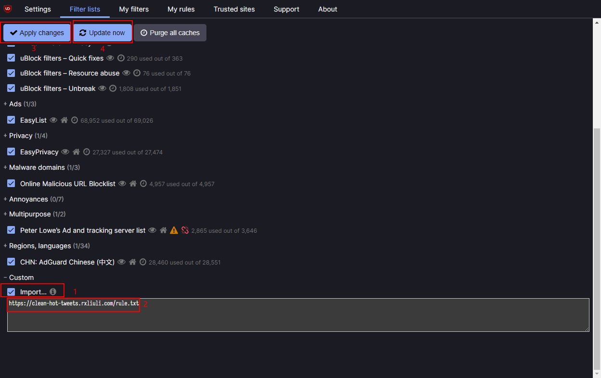

# 清理 twitter 热门事件的推文

之前就有这个想法，只是一直未曾找到一个好用的工具来处理图片。但现在吾辈认为即便只是屏蔽文字，也能处理许多容易引起争论的推文。

## 使用

Chrome 浏览器

1. 安装 [uBlock Origin 插件](https://chrome.google.com/webstore/detail/ublock-origin/cjpalhdlnbpafiamejdnhcphjbkeiagm)
2. 在 Custom 中添加链接 <https://clean-hot-tweets.rxliuli.com/rule.txt>
3. 保存并更新
  
